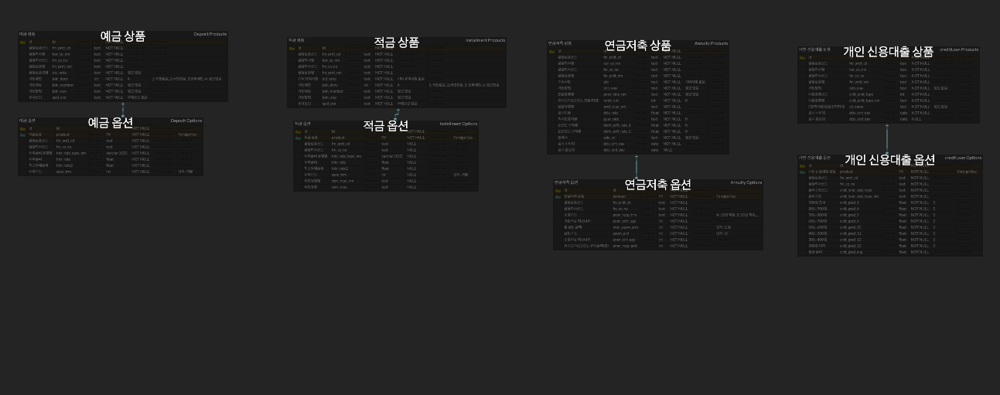
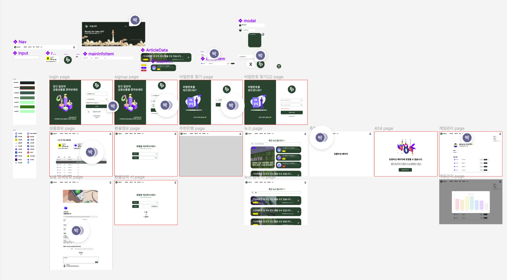
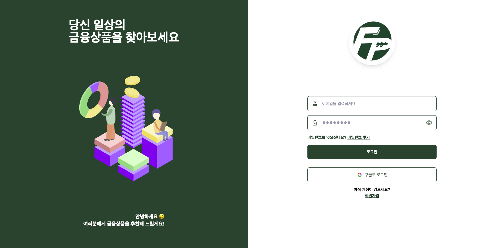
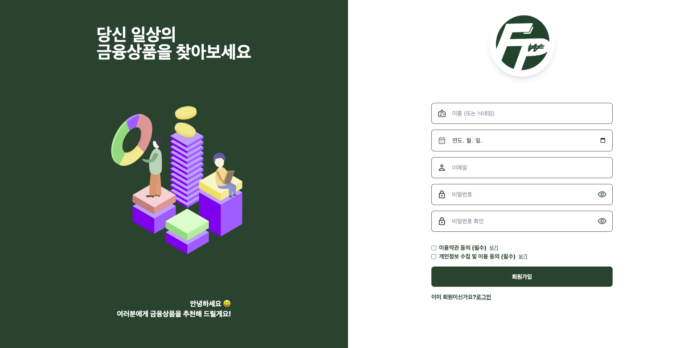
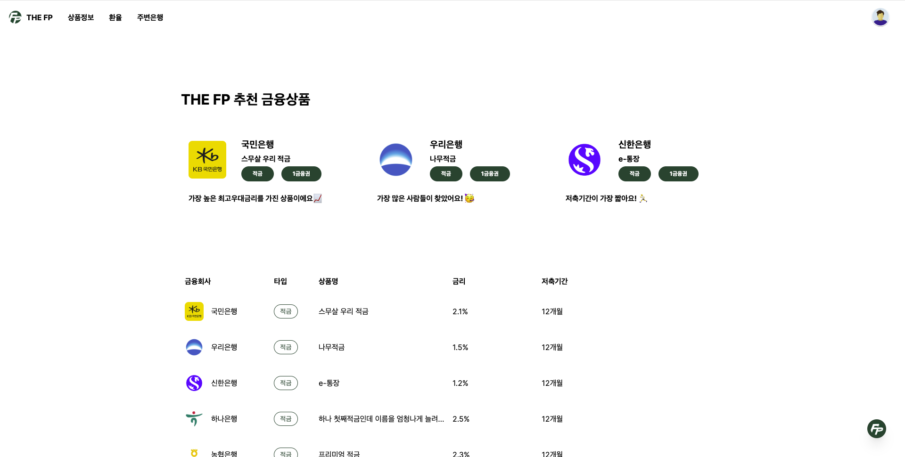
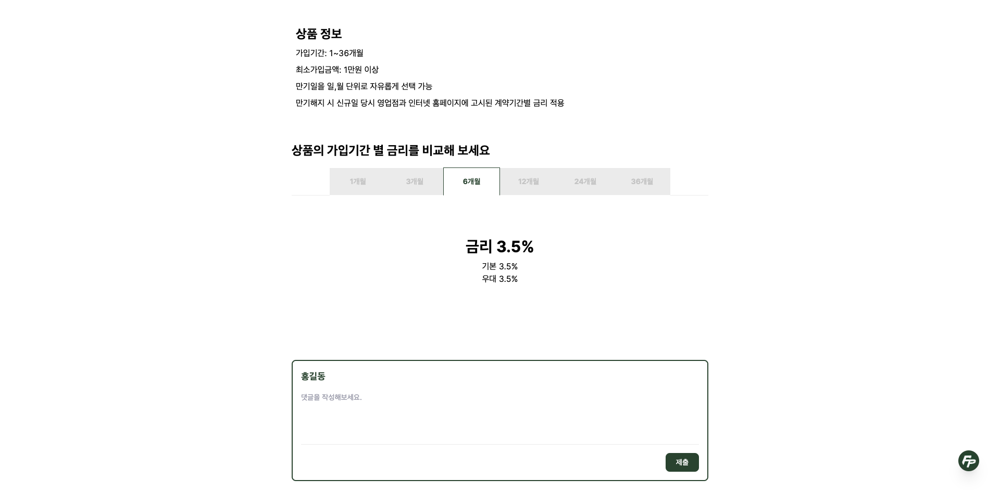
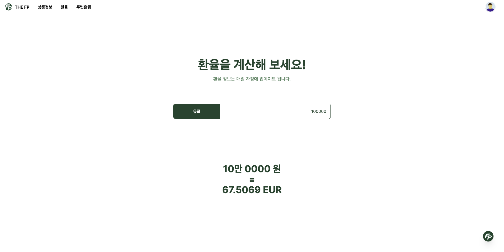
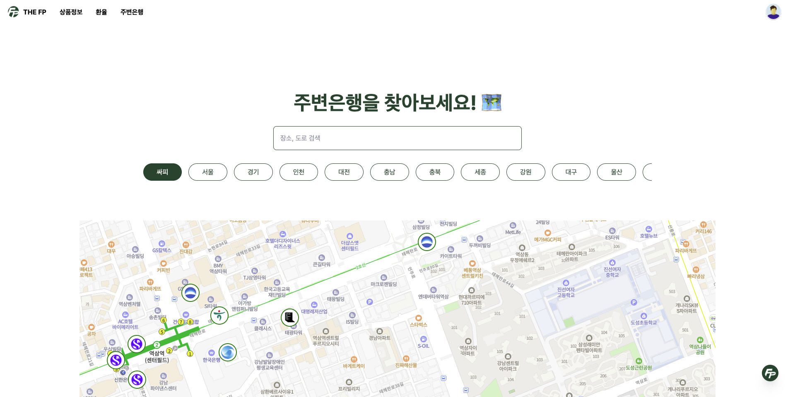
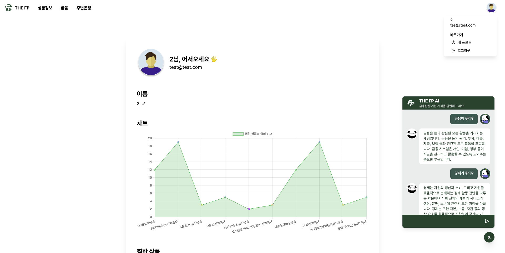
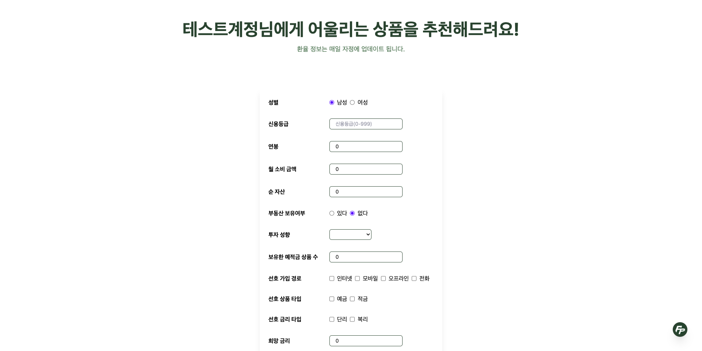

<div align="center">
    

  <h3 align="center">THE FP</h3>

  <p align="center">
    <h3><a href="https://thefp-bcw8u4ic8-coolfins-projects.vercel.app/">서비스 바로가기</a></h3>
  </p>
</div>

<br/>
<br/>
<br/>

### THE FP

---

금융상품 정보를 분류하고 사용자에게 금융상품을 추천해주는 프로젝트입니다. 환율 계산, 주변은행 등의 정보를 추가로 제공합니다.
<br/>
<br/>
<br/>

### Stacks

---

> FE

**언어**

<div style="display:flex; margin-bottom:20px;">

</div>

**라이브러리**

<div style="display:flex; flex-wrap:wrap; margin-bottom:20px;">


</div>

> BE

**언어**

<div style="display:flex; margin-bottom:20px;">

</div>

**라이브러리**

<div style="display:flex; flex-wrap:wrap; margin-bottom:20px;">


</div>

> 공통

**설계 및 환경**

<div style="display:flex; margin-bottom:20px;">


</div>

<br/>
<br/>
<br/>

### 실행방법

---

FE

```py
# 1. dependencies 설치
npm i

# 2. 실행
npm run dev
```

BE

```py
# 1. 가상환경 생성
python -m venv venv

# 2. 의존성 패키지 설치
pip isntall -r requirements.txt

# 3. DB 마이그레이션
python manage.py makemigrations
python manage.py migrate

# 4. 서버 실행
python manage.py runserver
```

<br/>
<br/>
<br/>

### 🔗 [ERD](https://www.erdcloud.com/d/GbegwswkZ6pTm9tzK)



---

<br/>
<br/>
<br/>

### 디자인



모든 페이지를 구성하며 세부사항은 다르지만 전체적인 틀이 같아 기능구현 이전에 개발하기 매우 수월했습니다.

---

<br/>
<br/>
<br/>

### 서비스 대표 기능

---

> 로그인
> 

> 회원가입
> 

> 비밀번호 찾기
>  > 

> 전체 금융상품 조회
> 

> 금융상품 상세조회
>  > 

> 환율
> 

> 주변은행 지도
> 

> 프로필
> 

> 상품추천
> 

<br/>
<br/>
<br/>

### 상품 추천 알고리즘

상품의 pk값을 target으로 고객의 개인정보에 적합한 상품을 추천해주는 로지스틱 회귀 모델을 개발했습니다.
상품, 옵션별로 데이터를 자세하게 나누어 1000명의 user에 대해 25000개의 상품 별 개인정보 데이터를 가지고 train, test 나누어 모델 학습 진행하고 이를 보여줍니다.

---

<br/>
<br/>
<br/>

### 🔗 [후기](https://coolfin.notion.site/408d7cf7eadb4ecf9bb1c8c4d362e1ef?pvs=4)

---

<br/>
<br/>
<br/>

### Contributors

---

<table>
  <tr>
    <td align="center">
      <a href="https://github.com/coolfin">
        <br />
        <sub><b>박상우</b></sub></a><br />
        <sub><b>FE / DESIGN / PM</b></sub></a><br />
	<sub><b></b></sub></a>
    </td>
    <td align="center">
      <a href="https://github.com/yoonkyungseo">
        <br />
        <sub><b>윤경서</b></sub></a><br />
        <sub><b>BE / ML</b></sub></a><br />
    </td>

  </tr>
</table>
